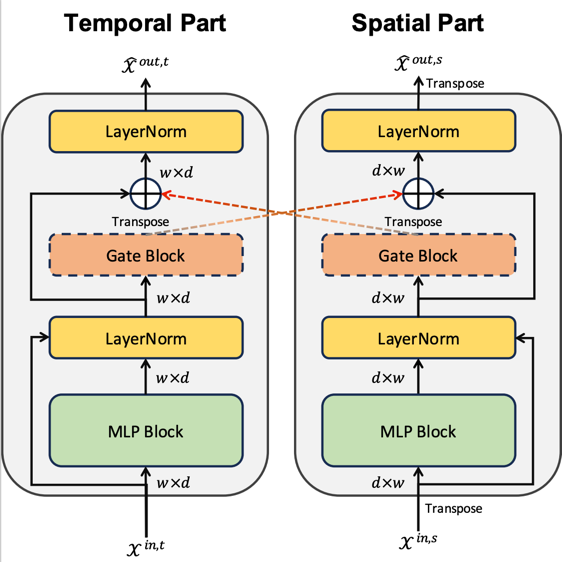
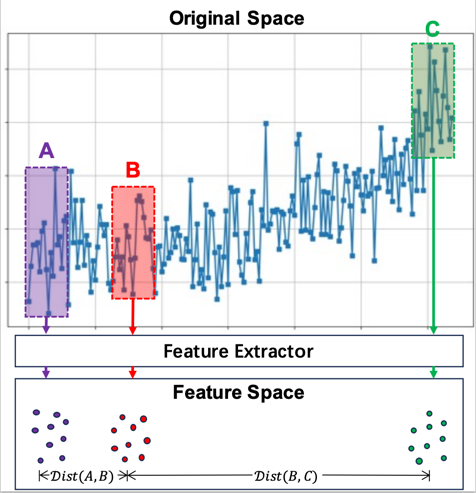

# Supervised Contrastive Learning based Dual-Mixer Model for Remaining Useful Life Prediction
This repository is the implementation for the paper Supervised Contrastive Learning based Dual-Mixer Model for Remaining Useful Life Prediction: https://arxiv.org/abs/2401.16462. 

The paper proposes a novel progressive feature fusion model called **Dual-path Mixer Model (Dual-Mixer)** for RUL prediction, 
as well as a feature constraint method based on supervised contrastive learning called **Feature Space Global Relationship Invariance (FSGRI)**.

## Dual-Mixer Model
The Dual-Mixer Model is constructed based on multi-layer MLP. 

The core module of this model is the Dual-path Mixer Layer, which implements a progressive feature fusion process layer by layer:

## FSGRI
FSGRI is a constraint method in feature space for the RUL prediction task. It expands the degradation relationship 
from the original data space to the feature space and is applicable to most deep learning RUL prediction methods:

## Quick Start

### Requirements
torch >= 2.0  
matplotlib >= 3.7.0  
numpy >= 1.24.3  
pandas >= 2.0.0  
scikit-learn >= 1.3.0

### Dataset
Our experiments are base on the CMAPSS dataset [1]. 

The raw data could be downloaded from: https://github.com/schwxd/LSTM-Keras-CMAPSS/tree/master/C-MAPSS-Data.

After downloading, place the data files train_FD00X.txt, test_FD00X.txt, 
and RUL_FD00X.txt in the raw_data/ folder (or any other folder you specify).

The dataset/cmapss.py contains all the code for preprocessing dataset, including the Gaussian Threshold Sampling method proposed
in this paper.

### Train
Simply run :
> python ./models/RULPrediction/experiments.py

This will execute the training process of the Dual-Mixer on the FD004 dataset. The training results are restored in
the train/*model_flag* folder, where *model_flag* is generated automatically.

If you placed the dataset in a folder other than raw_data/, you need to modify the parameter 
*cmapss.DEFAULT_ROOT* on **line 56** in the *experiments.py* file:
>     train, test, val, scalar = cmapss.get_data(cmapss.DEFAULT_ROOT, ...

to:
>     train, test, val, scalar = cmapss.get_data(your_data_path, ...

You can edit experiments.py to modify different training parameters, such as Batch Size (***bs***), ***mixer_layer_num***, etc.

The ***net*** object in experiments.py can be changed to the following models:
> MLPMixer / BiGRU_TSAM / IMDSSN et al.

More details can be found in their respective code files.

## References
1. Abhinav Saxena, Kai Goebel, Don Simon, and Neil Eklund. Damage propagation modeling for aircraft engine run-to-failure simulation. In
2008 International Conference on Prognostics and Health Management. IEEE, 2008.
